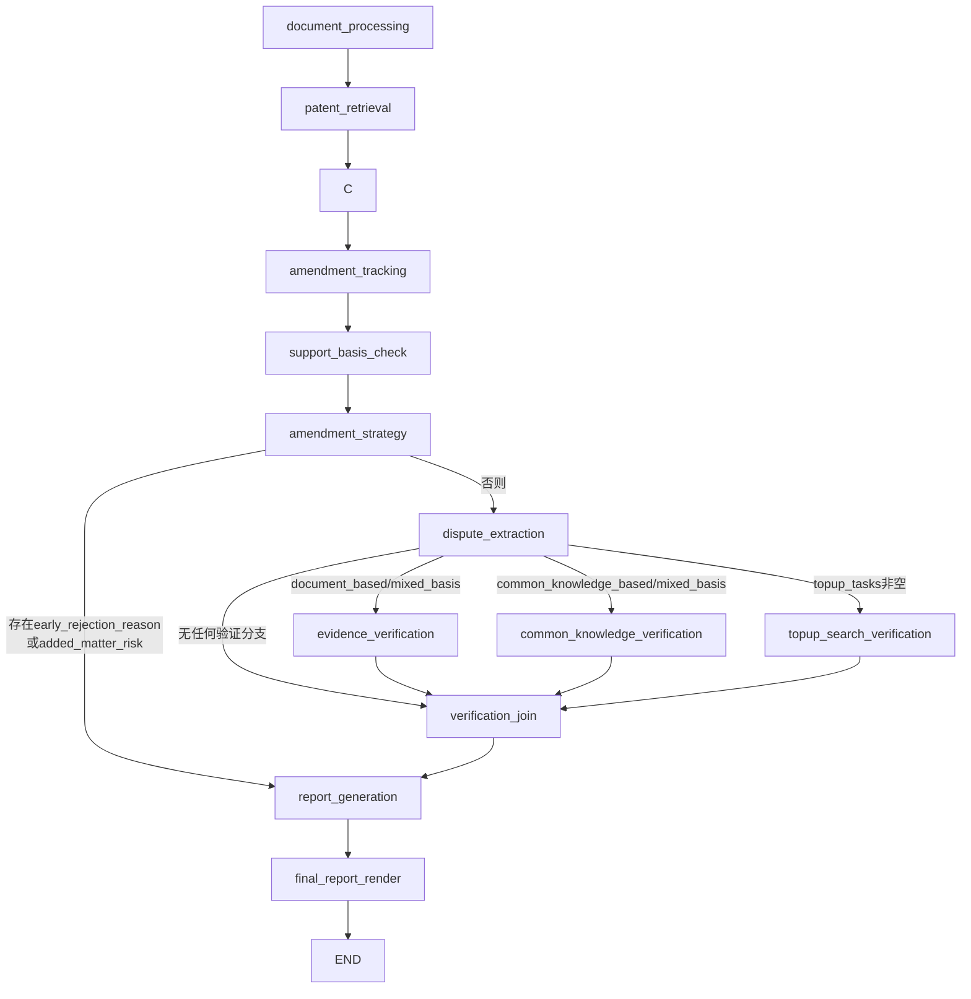

# Office Action Reply Agent

## 1. 模块定位

`ai_reply` 是一个基于 LangGraph 的 AI 答复辅助工作流，目标是：

1. 解析审查意见通知书、意见陈述书、不同版本权利要求书、对比文件。
2. 识别争辩焦点并分流到不同核查路径。
3. 生成统一 JSON 报告，并渲染为 Markdown / PDF。

入口文件：`agents/ai_reply/main.py`

---

## 2. 主要功能

1. 文档解析与结构化
2. 对比文件专利下载与结构化提取
3. 修改差异追踪（新增特征识别）
4. 修改超范围风险核查
5. 审查策略分流（复用历史评述 / 补充检索）
6. 争辩焦点抽取
7. 三路验证（证据核查 / 公知常识核查 / 补充检索核查）
8. 汇总、生成下一通审查意见通知书要点、输出最终报告

---

## 3. 输入与输出

## 3.1 输入文件类型

- `office_action`：审查意见通知书（PDF / DOC / DOCX）
- `response`：意见陈述书（PDF / DOC / DOCX）
- `claims_previous`：上一版权利要求书（PDF / DOC / DOCX，可选）
- `claims_current`：当前最新权利要求书（PDF / DOC / DOCX，可选）
- `comparison_doc`：非专利对比文件（PDF / DOC / DOCX，可多份）

## 3.2 主要输出

默认输出目录：`output/<task_id>/`

- `final_report.json`：结构化结果
- `final_report.md`：可读 Markdown 报告
- `final_report.pdf`：最终 PDF 报告
- `.cache/*.json`：各节点缓存

---

## 4. 全流程执行逻辑

工作流定义位置：`create_workflow()`（`agents/ai_reply/main.py`）



---

## 5. 节点职责说明

## 5.1 前处理与策略阶段

1. `document_processing`
   - 将输入文件解析为 Markdown。
   - Word 文件默认走本地优先解析：`.docx -> pypandoc_binary`，`.doc -> LibreOffice 转 .docx -> pypandoc_binary`。
   - 本地 Word 解析失败时自动回退到 Mineru 在线解析。
   - 对 `office_action` 做结构化提取。
   - 校验 `office_action.application_number` 与 `office_action.current_notice_round` 必须存在，否则节点失败。
   - 对 `claims_previous`、`claims_current` 分别做结构化提取。

2. `patent_retrieval`
   - 对原申请号和专利型对比文件执行下载+解析+结构化提取。
   - 仅处理专利文献，非专文件不走该节点。

3. `data_preparation`
   - 统一组装 `prepared_materials`。
   - 强校验“非专文献数量”和“上传非专文件数量”一致。
   - 将专利对比文件数据与非专文件全文映射到统一数据结构。

4. `amendment_tracking`
   - 对比新旧权利要求，抽取新增特征（`added_features`）。
   - 标记来源：`claim`（上提）或 `spec`（说明书特征）。

5. `support_basis_check`
   - 仅针对 `source_type=spec` 的新增特征核查是否有原说明书记载。
   - 输出 `support_findings`、`added_matter_risk`、`early_rejection_reason`。

6. `amendment_strategy`
   - 将新增特征分为：
     - `reuse_oa_tasks`：可复用原审查意见的任务
     - `topup_tasks`：需要补充检索验证的任务

7. `dispute_extraction`
   - 从 `office_action.paragraphs` 和 `response.content` 抽取争辩焦点 `disputes`。
   - 对字段合法性、`supporting_docs`、`dispute_id` 做校正与兜底。

## 5.2 验证与报告阶段

8. `evidence_verification`
9. `common_knowledge_verification`
10. `topup_search_verification`
11. `verification_join`
12. `report_generation`
13. `final_report_render`

第 8~10 节点是本模块核心验证层，详见下文第 7 节。

---

## 6. 节点间路由规则（重点）

## 6.1 全局通用规则

- 所有主要节点都配置了 `RetryPolicy(max_attempts=config.max_retries)`。
- 大部分节点使用统一路由工厂 `create_router(next_node)`：
  - 若 `state.status == "failed"` -> 跳 `handle_error`
  - 否则 -> 进入下一个节点

## 6.2 关键条件路由

1. `document_processing` 后路由
   - 条件：`state.status` 是否失败
   - 失败 -> `handle_error`
   - 成功 -> 固定进入 `patent_retrieval`

2. `amendment_strategy` 后路由
   - 条件：
     - `early_rejection_reason` 非空，或
     - `added_matter_risk == True`
   - 满足 -> 直接 `report_generation`（提前结束争议验证）
   - 否则 -> `dispute_extraction`

3. `dispute_extraction` 后路由（可并行）
   - 会扫描 `disputes[*].examiner_opinion.type` 与 `topup_tasks`
   - 路由规则：
     - 存在 `document_based` 或 `mixed_basis` -> 加入 `evidence_verification`
     - 存在 `common_knowledge_based` 或 `mixed_basis` -> 加入 `common_knowledge_verification`
     - `topup_tasks` 非空 -> 加入 `topup_search_verification`
   - 若以上都不满足 -> 直达 `verification_join`
   - 若命中多个分支 -> LangGraph 并行执行多个验证节点

4. `verification_join` 路由
   - 检查 `errors` 中是否含三个验证节点的错误
   - 有任一验证错误 -> `status=failed` -> `handle_error`
   - 无验证错误 -> `report_generation`

5. `report_generation` -> `final_report_render` -> `END`

---

## 7. 三个验证节点详解（重点）

## 7.1 `evidence_verification`（事实证据核查）

### 触发条件

- `dispute_type` 为 `document_based` 或 `mixed_basis`。

### 核心逻辑

1. 从状态与 `prepared_materials` 提取：
   - 当前 OA 审查所针对的权利要求文本（`claims_old_structured`）
   - 对比文件内容映射（`document_id -> content`）
2. 按 `supporting_docs.doc_id` 组合对争议分组，复用同一组文档上下文。
3. 对每个争议调用 LLM，输出：
   - `assessment.verdict`：`APPLICANT_CORRECT / EXAMINER_CORRECT / INCONCLUSIVE`
   - `assessment.reasoning`
   - `assessment.confidence`
   - `assessment.examiner_rejection_rationale`（仅当 verdict=APPLICANT_CORRECT 时强制非空）
   - `evidence[]`
4. 结果写入统一结构 `evidence_assessments[]`，并携带 `trace.used_doc_ids/missing_doc_ids`。

### 严格约束

- `confidence` 必须在 `[0,1]`
- `evidence.doc_id` 必须属于当前争议的 `supporting_docs`

---

## 7.2 `common_knowledge_verification`（公知常识核查）

### 触发条件

- `dispute_type` 为 `common_knowledge_based` 或 `mixed_basis`。

### 核心逻辑

1. 先调用 LLM 生成按引擎拆分的检索查询条件：
   - `openalex`（英文偏学术）
   - `zhihuiya`（中文偏专利语义）
   - `tavily`（中文偏网页证据）
   - 若 LLM 失败则使用规则兜底模板。
2. 外部证据聚合：
   - 学术：OpenAlex
   - 专利：智慧芽语义检索
   - 网页：Tavily
   - 聚合后去重并编号为 `EXT1...`
3. 若外部证据为空：
   - 退化为模型知识低置信判断（允许 `doc_id=MODEL`）
4. 调用 LLM 输出统一 `assessment + evidence`。
5. 输出 `trace`：
   - `used_doc_ids`
   - `retrieval`（按引擎记录 `queries/filters/result_count/results`）

### 严格约束

- `verdict` 与 `confidence` 范围校验同上
- `verdict=APPLICANT_CORRECT` 时，`examiner_rejection_rationale` 必须非空
- 证据 `doc_id` 必须在 `EXT*` 或 `MODEL` 白名单中

---

## 7.3 `topup_search_verification`（补充检索核查）

### 触发条件

- `topup_tasks` 非空。
- `topup_tasks` 来源于 `amendment_strategy`，典型场景：
  - 新增特征无法直接复用原审查意见；
  - 新增特征来自说明书或未覆盖 claim。

### 核心逻辑

1. 每个 `topup_task` 先构造一个新争议 `TOPUP_<task_id>`。
2. 两路证据准备：
   - 本地对比文件深扫（命中关键词生成 `D*` 证据片段）
   - 外部检索聚合（查询条件由 LLM 按 OpenAlex/智慧芽/Tavily 生成，结果编号 `EXT*`）
3. 调用 LLM 同时产出：
   - `examiner_opinion`
   - `applicant_opinion`
   - `assessment`
   - `evidence`
4. 同时更新两个状态字段：
   - `disputes[]`（新增 `origin=amendment_review` 的修改评判项）
   - `evidence_assessments[]`（新增对应的修改评判核查结果）

### 严格约束

- `examiner_opinion.type` 仅允许三种枚举值
- `document_based/mixed_basis` 必须有 `supporting_docs`
- `supporting_docs.doc_id` 不能是 `MODEL`
- `evidence.doc_id` 必须在允许证据集合内

---

## 8. 并行分支如何合并

`WorkflowState` 中多个列表字段使用 `Annotated[..., operator.add]` 声明（如 `disputes`, `evidence_assessments`, `errors`）。

这意味着：

1. 并行分支返回结果会做“列表拼接”合并。
2. `verification_join` 不做业务级去重，只负责状态判定与汇合。
3. `report_generation` 通过 `dispute_id` 建立 `evidence_assessment` 映射并组装最终报告。

---

## 9. 报告生成规则

`report_generation` 负责：

1. 生成 `summary`
   - 仅统计 `origin=response_dispute` 的真正争论点
   - 输出争议总数、已核查数、裁决分布、反驳类型分布、申请人答复要点数
2. 生成 `amendment_section`
   - 包含修改风险概览
   - 包含 `change_items`，逐项展示新增/修改特征的 AI 评判、理由、证据与最终审查结论
3. 生成 `claim_review_section`
   - 基于 `claim_review_drafting` 的结果，按当前生效权利要求逐条输出正式评述
4. 生成 `response_dispute_section`
   - 只保留 `origin=response_dispute` 的争论点及其 AI 核查结果
5. 生成 `response_reply_section`
   - 只保留针对申请人意见陈述的正式答复文本
   - 由 `rejection_drafting` 输出的 `final_examiner_rejection_reason` 组装而成

---

## 10. 运行方式

## 10.1 CLI

```bash
python -m agents.ai_reply.main \
  --office-action /path/to/office_action.pdf \
  --response /path/to/response.pdf \
  --claims-previous /path/to/claims_previous.pdf \
  --claims-current /path/to/claims_current.pdf \
  --comparison-docs /path/to/non_patent1.pdf,/path/to/non_patent2.pdf
```

## 10.2 后端任务调度

- API 路由会调用同一 `create_workflow()` 构建图并执行。
- 任务完成后会登记：
  - PDF 路径
  - Markdown 路径（若存在）
  - JSON 路径（若存在）

---

## 11. 关键环境变量

- `PDF_PARSER`：PDF 解析器（默认 `local`）
- `OPENALEX_API_KEYS` / `OPENALEX_BASE_URL`：学术证据检索（支持多 key 轮换，多个 key 可用逗号/分号/换行分隔）
- `TAVILY_API_KEYS` / `TAVILY_BASE_URL`：网页证据检索（支持多 key 轮换，单 key 也使用该变量，超限自动切换）
- `ZHIHUIYA_*`：专利下载账号参数

---

## 12. 失败与兜底机制

1. 关键前置节点失败（例如 `data_preparation`）会使 `state.status=failed`，并路由到 `handle_error`。
2. 三个验证节点异常时，通常只写入 `errors`，最终由 `verification_join` 统一判定失败。
3. 所有节点均支持缓存命中，避免重复调用外部 API 与 LLM。
