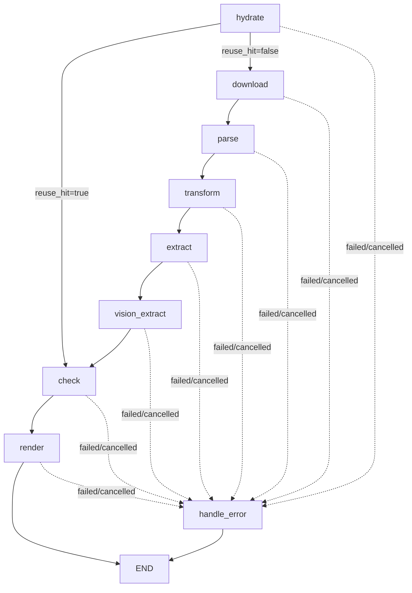

# AI Review Agent

## 1. 模块定位

`ai_review` 是独立的 AI 审查工作流，目标是输出“说明书文字标号 vs 附图标号”的一致性审查结论。

它优先复用历史分析产物中的 `parts + image_parts`，命中后直接进入审查；未命中时自动回退到完整前处理链路。

入口文件：`agents/ai_review/main.py`

---

## 2. 工作流拓扑

`create_workflow()`（`agents/ai_review/main.py`）定义如下：



---

## 3. 复用机制（`hydrate`）

## 3.1 数据来源

后端任务入口 `run_ai_review_task()` 会先尝试加载 R2 的分析缓存（`analysis/<pn>.json`），并以 `cached_analysis` 传入工作流。

## 3.2 命中条件

`HydrateNode` 判定为可复用需同时满足：
- `cached_analysis` 是字典
- `cached_analysis.parts` 是字典
- `cached_analysis.image_parts` 是字典

命中后：
- 写入 `parts_db`、`image_parts`
- 设置 `reuse_hit=True`
- 优先用 `cached_analysis.metadata.resolved_pn` 回填产物命名
- 路由直接跳到 `check`

未命中则 `reuse_hit=False`，走 `download -> parse -> transform -> extract -> vision_extract` 全流程。

---

## 4. 节点职责与输入输出

## 4.1 `download` / `parse` / `transform` / `extract` / `vision_extract`

这 5 个节点在 `agents/ai_review/src/nodes/` 下独立实现，行为与主分析流水线保持一致：
- `download`：下载或复制 `raw.pdf`
- `parse`：生成 `raw.md + images`
- `transform`：生成 `patent.json` 并解析 `resolved_pn`
- `extract`：生成 `parts.json`
- `vision_extract`：生成 `image_parts.json + image_labels.json`

## 4.2 `check`

- 节点实现位于 `agents/ai_review/src/nodes/check_node.py`。
- 调用 `FormalExaminer.check()`（规则版一致性检查）。
- 检查集合：
  - 说明书有、附图无
  - 附图有、说明书无
- 输出：`check.json`，结构为：
  - `consistency`（Markdown 文本结论）

## 4.3 `render`

- 输入：`check_result`
- 生成独立 AI 审查报告：
  - `<resolved_pn>_ai_review.md`
  - `<resolved_pn>_ai_review.pdf`
- 报告包含：
  - 审查依据（细则第二十一条）
  - 最终一致性结论（`consistency`）

---

## 5. 输入输出与目录结构

## 5.1 输入

CLI 参数互斥二选一：
- `--pn`：按专利号处理
- `--upload-file`：直接用上传 PDF 处理

可选参数：
- `--task-id`：任务 ID

## 5.2 主要输出目录

默认目录：`output/<task_id>/`

常见文件：
- 前处理中间文件（复用 `patent_analysis` 路径约定）
  - `raw.pdf`
  - `mineru_raw/raw.md`
  - `mineru_raw/images/*`
  - `patent.json`
  - `parts.json`
  - `image_parts.json`
  - `image_labels.json`
- 审查结果
  - `check.json`
  - `<resolved_pn>_ai_review.md`
  - `<resolved_pn>_ai_review.pdf`

实现说明：
- `ai_review` 运行时不依赖 `agents/patent_analysis` 包内节点定义。

后端任务模式下会额外写入：
- `ai_review.json`（包含 `metadata/check_result/artifact_refs`）

---

## 6. 进度、状态与 Checkpoint

节点进度（`BaseNode.progress`）：
- `hydrate`: 5
- `download`: 10
- `parse`: 20
- `transform`: 30
- `extract`: 40
- `vision_extract`: 55
- `check`: 65
- `render`: 95

状态流转由基类统一维护：
- `pending / running / completed / cancelled / failed`

Checkpoint（启用时）：
- `thread_id = task_id`
- `checkpoint_ns = ai_review`

后端任务模式下通过 `AI_REVIEW_NODE_LABELS` 将节点状态映射到任务进度文本。

---

## 7. 运行方式

## 7.1 CLI 示例

按专利号：

```bash
python -m agents.ai_review.main --pn CN202010000000.0 --task-id review001
```

按上传文件：

```bash
python -m agents.ai_review.main --upload-file /path/to/patent.pdf --task-id review002
```

## 7.2 关键环境变量

- `PDF_PARSER`：PDF 解析器类型（默认 `local`）
- `OCR_ENGINE`：OCR 引擎（`local` / `online`）

---

## 8. 取消与异常处理

- 节点执行前统一检查 `cancel_event`，命中后状态置为 `cancelled`。
- 任一节点抛错会写入 `errors` 并流向 `handle_error`，最终状态为 `failed`。
- 渲染阶段会校验输入 `check_result`，缺失则直接失败，避免生成无效报告。
