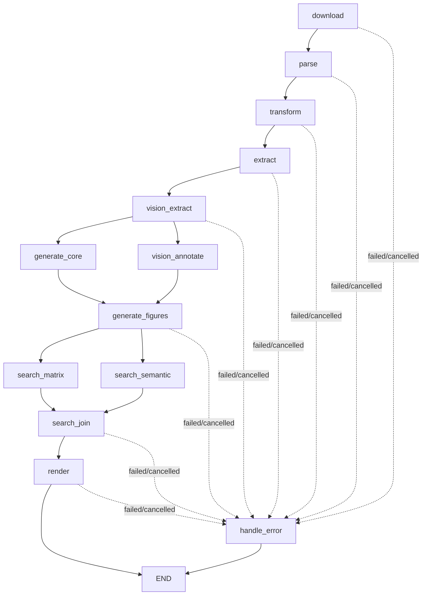

# Patent Analysis Agent

## 1. 模块定位

`patent_analysis` 是单篇专利技术分析工作流，基于 LangGraph 组织“下载/解析/结构化/知识提取/视觉识别/报告生成/检索策略/渲染”全流程。

入口文件：`agents/patent_analysis/main.py`

---

## 2. 工作流拓扑

`create_workflow()`（`agents/patent_analysis/main.py`）当前挂载的节点如下：



说明：
- `vision_extract -> (generate_core, vision_annotate)` 为并行分支。
- `generate_figures -> (search_matrix, search_semantic)` 为并行分支。
- AI 审查链路已拆分到 `agents/ai_review`，本工作流仅负责 AI 分析与检索策略产出。

---

## 3. 节点职责与输入输出

## 3.1 `download`

- 优先复用 `output/<task_id>/raw.pdf`。
- 有 `upload_file_path` 时复制上传文件到 `raw.pdf`。
- 否则通过智慧芽客户端下载专利原文。
- 输出：`raw.pdf`，并写回 `resolved_pn`（优先使用输入 PN）。

## 3.2 `parse`

- 输入：`raw.pdf`
- 调用 `PDFParser.parse(...)` 生成：
  - `mineru_raw/raw.md`
  - `mineru_raw/images/*`
- 若 `raw.md` 已存在则跳过解析。

## 3.3 `transform`

- 输入：`raw.md`
- 调用 `extract_structured_data(..., method="hybrid")`。
- 输出：`patent.json`。
- 若任务未显式传入 PN，则从 `bibliographic_data.publication_number` 回填 `resolved_pn`，并刷新最终产物命名路径。

## 3.4 `extract`

- 输入：`patent_data`（缺失时回读 `patent.json`）
- 调用 `KnowledgeExtractor.extract_entities()`，输出部件知识库：`parts.json`。
- 若 `parts.json` 已存在则直接复用。

## 3.5 `vision_extract`

- 输入：`patent_data + parts_db`
- 调用 `VisualProcessor.extract_image_labels()` 执行 OCR + VLM 纠错。
- 输出：
  - `image_parts.json`（图 -> 部件标号）
  - `image_labels.json`（图 -> 标注框与标签）
- 若两个文件均存在则直接复用。

## 3.6 `vision_annotate`

- 输入：`image_labels`（缺失时回读 `image_labels.json`）
- 调用 `VisualProcessor.annotate_from_image_labels()` 渲染标注图。
- 输出目录：`annotated_images/*`（无标签图会原样拷贝）。

## 3.7 `generate_core`

- 输入：`patent_data + parts_db + image_parts`
- 调用 `ContentGenerator.generate_core_report_json()` 生成核心分析内容。
- 输出：`report_core.json`。
- 若文件已存在则直接复用。

## 3.8 `generate_figures`

- 输入：`report_core_json + patent_data + parts_db + image_parts`
- 调用 `ContentGenerator.generate_figure_explanations(...)` 生成图解说明并合并核心报告。
- 输出：`analysis.json`（工作流内部字段名为 `analysis_json`）。
- 若 `analysis.json` 已存在则直接复用。

## 3.9 `search_matrix` / `search_semantic` / `search_join`

- `search_matrix`：构建检索要素矩阵（列表）。
- `search_semantic`：构建语义检索策略（对象）。
- `search_join`：合并并落盘 `search_strategy.json`。

`search_matrix` 单项字段：
- `element_name`
- `element_role`：`Subject` / `KeyFeature` / `Functional`
- `block_id`：`A` / `B1..Bn` / `C`
- `effect_cluster_id`：`E1..En`（仅核心子块）
- `is_hub_feature`：是否跨核心效果复用
- `term_frequency`：`low` / `high`
- `priority_tier`：`core` / `assist` / `filter`
- `element_type`：`Product_Structure` / `Method_Process` / `Algorithm_Logic` / `Material_Composition` / `Parameter_Condition`
- `keywords_zh`
- `keywords_en`
- `ipc_cpc_ref`

`semantic_strategy` 字段：
- `name`
- `description`
- `queries`：列表，每项包含 `query_id`（`B1..Bn`）、`effect_cluster_id`（`E1..En`）、`effect`（关联技术效果文本）、`content`

## 3.10 `render`

- 输入：`patent_data + analysis_json + search_json`
- 调用 `ReportRenderer.render(...)` 渲染最终 Markdown/PDF。
- 输出：
  - `output/<task_id>/<resolved_pn>.md`
  - `output/<task_id>/<resolved_pn>.pdf`

---

## 4. 缓存与复用策略

## 4.1 文件级复用

以下文件存在即复用，避免重复计算：
- `raw.md`
- `patent.json`
- `parts.json`
- `image_parts.json`
- `image_labels.json`
- `report_core.json`
- `analysis.json`
- `search_strategy.json`

## 4.2 StepCache 复用

以下节点通过 `StepCache` 复用 LLM 中间结果，缓存目录：`output/<task_id>/.cache/`：
- `generate_core_cache.json`
- `generate_figures_cache.json`
- `search_matrix_cache.json`
- `search_semantic_cache.json`

检索缓存版本键：
- `search_matrix_v3`
- `semantic_strategy_v2`

## 4.3 后端任务级复用（R2）

在 `backend/routes/tasks.py` 的 `run_patent_analysis_task()` 中：
- 若命中 R2 的历史 `analysis/<pn>.json` 且对应 PDF 存在，可直接完成任务，不进入 LangGraph 工作流。

---

## 5. 输出目录与产物

默认目录：`output/<task_id>/`

常见文件：
- 输入与解析
  - `raw.pdf`
  - `mineru_raw/raw.md`
  - `mineru_raw/images/*`
- 中间结构化数据
  - `patent.json`
  - `parts.json`
  - `image_parts.json`
  - `image_labels.json`
  - `report_core.json`
  - `analysis.json`
  - `search_strategy.json`
- 渲染结果
  - `<resolved_pn>.md`
  - `<resolved_pn>.pdf`
  - `annotated_images/*`
- 缓存
  - `.cache/*.json`

---

## 6. 运行方式

## 6.1 CLI

按专利号运行：

```bash
python -m agents.patent_analysis.main --pn CN202010000000.0 --task-id demo001
```

按上传 PDF 运行：

```bash
python -m agents.patent_analysis.main --upload-file /path/to/patent.pdf --task-id demo002
```

参数约束：
- `--pn` 与 `--upload-file` 二选一（互斥且必填其一）。

## 6.2 关键环境变量

- `PDF_PARSER`：PDF 解析器类型（默认 `local`）。
- `OCR_ENGINE`：视觉 OCR 引擎（`local` 或 `online`，其他值会回退 `local`）。

---

## 7. 状态、进度与 Checkpoint

- 节点基类 `BaseNode` 统一维护：`current_node`、`progress`、`status`。
- 状态优先级：`pending < running < completed < cancelled < failed`。
- `create_workflow()` 在 `enable_checkpoint=True` 时启用 checkpoint：
  - `thread_id = task_id`
  - `checkpoint_ns = patent_analysis`

后端任务模式下，`backend/routes/tasks.py` 使用 `PATENT_NODE_LABELS` 同步步骤进度，不再依赖 `DEFAULT_PIPELINE_STEPS` 常量。

---

## 8. 取消与异常处理

- 每个节点执行前检查 `cancel_event`，命中则抛出 `PipelineCancelled`，状态置为 `cancelled`。
- 任一节点异常会写入 `errors` 并路由到 `handle_error`，最终状态为 `failed`（或保留 `cancelled`）。
- 渲染阶段会校验 PDF 存在且非空，防止“空文件成功”。
