(21)申请号 202310976129 .5

B08B 1/04 (2006.01)

(22)申请日 2023.08.04

H05K 5/02(2006.01)

(71)申请人 中交第一航务工程局有限公司

地址 300461 天津市滨海新区港保税区跃进路航运服务中心8号楼

(72)发明人 李晶坤 罗斌 田振海 杜一豪  
(74)专利代理机构 成都信捷同创知识产权代理

事务所(普通合伙) 51323

专利代理师 杨雪

(51)Int.Cl.

G01M 5/00 (2006.01)

B08B 1/00 (2006.01)

B08B 3/08 (2006.01)

B08B 3/10 (2006.01)

B08B 13/00 (2006.01)

权利要求书2页 说明书7页 附图9页

# (54)发明名称

一种桥梁钢结构挠度检测装置及检测方法

# (57)摘要

本发明公开了一种桥梁钢结构挠度检测装置及检测方法，涉及桥梁钢检测技术领域，包括支撑座、支腿、支柱和测量模块，所述支撑座的表面固定连接有液压伸缩杆，所述支腿的表面固定连接有万向轮，还包括：设置在所述液压伸缩杆表面，用以对桥梁挠度检测时对桥梁底部污垢进行清除的清洁装置，所述清洁装置包括固定连接在液压伸缩杆一端的底座，所述底座的表面固定连接有电机，所述电机的输出端固定连接有支撑杆，所述支撑杆的圆弧面固定连接有连接板，通过设置清洁装置，提高了检测装置对桥梁底部的清洁效果，减少了桥梁底部产生的青苔污垢会影响检测结果的精准度的问题，方便了对桥梁钢结构挠度进行检测，进一步提高了检测装置的实用性。

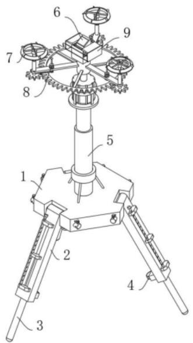

1 .一种桥梁钢结构挠度检测装置，包括支撑座（1）、支腿（2）、支柱（3）和测量模块（6），其特征在于：所述支撑座（1）的表面固定连接有液压伸缩杆（5），所述支腿（2）的表面固定连接有万向轮（4），还包括：  
设置在所述液压伸缩杆（5）表面，用以对桥梁挠度检测时对桥梁底部污垢进行清除的清洁装置（7），所述清洁装置（7）包括固定连接在液压伸缩杆（5）一端的底座（701），所述底座（701）的表面固定连接有电机（702），所述电机（702）的输出端固定连接有支撑杆（703），所述支撑杆（703）的圆弧面固定连接有连接板（713）、用于对桥梁挠度检测时对桥梁底部污垢进行清除的清洁圈（707）与刮板（708）；  
设置在所述连接板（713）表面，用以对桥梁底部喷洒清洁剂的喷洒装置（8），所述喷洒装置（8）包括放置于连接板（713）内部的囊瓶（81）、用于对桥梁底部喷洒清洗剂的喷管（82）；  
设置在所述支撑杆（703）表面，用以对测量模块（6）进行防护的防护装置（9），所述防护装置（9）包括固定连接在支撑杆（703）内壁的电动伸缩杆（91）、用于对测量模块（6）进行防护的防护罩（93）与防护板（94）。  
2 .根据权利要求1所述的一种桥梁钢结构挠度检测装置，其特征在于：所述清洁装置（7）还包括转杆（704），所述转杆（704）与连接板（713）转动连接，所述转杆（704）的内壁滑动连接有两个滑块（705），两个所述滑块（705）彼此接近的一面固定连接有滑杆（706），所述清洁圈（707）与滑杆（706）固定连接，所述刮板（708）与清洁圈（707）固定连接。  
3 .根据权利要求2所述的一种桥梁钢结构挠度检测装置，其特征在于：所述转杆（704）的内壁固定连接有弹簧（710），所述弹簧（710）的一端与滑杆（706）固定连接。  
4 .根据权利要求1所述的一种桥梁钢结构挠度检测装置，其特征在于：所述清洁圈（707）的表面固定连接有若干个刮片（709），所述刮片（709）呈倾斜状分布。  
5 .根据权利要求2所述的一种桥梁钢结构挠度检测装置，其特征在于：所述支撑杆（703）的圆弧面固定连接有齿环（711），所述转杆（704）的一端固定连接有齿轮（712），所述齿环（711）与齿轮（712）的齿面相啮合。  
6 .根据权利要求2所述的一种桥梁钢结构挠度检测装置，其特征在于：所述喷洒装置（8）还包括喷头（83），所述喷头（83）与喷管（82）固定连接，所述喷管（82）与囊瓶（81）固定连接，所述囊瓶（81）的表面固定连接有固定环（84），所述连接板（713）的表面开设有圆孔，所述固定环（84）与连接板（713）表面的圆孔螺纹连接，所述囊瓶（81）的内部填充有清洁剂，所述囊瓶（81）为折叠结构，所述囊瓶（81）的下表面固定连接有第一斜块（85），所述转杆（704）的圆弧面固定连接有第二斜块（86），所述第一斜块（85）与第二斜块（86）的斜面相契合。  
7 .根据权利要求6所述的一种桥梁钢结构挠度检测装置，其特征在于：所述第一斜块（85）的表面转动连接有滚珠（87），所述滚珠（87）为圆球体结构。  
8 .根据权利要求1所述的一种桥梁钢结构挠度检测装置，其特征在于：所述防护装置（9）还包括底板（92），所述底板（92）与电动伸缩杆（91）固定连接，所述防护罩（93）与支撑杆（703）固定连接，所述防护罩（93）的内壁滑动连接有四个挡块（97），四个所述挡块（97）两两一组，所述防护板（94）与挡块（97）固定连接，所述防护板（94）的表面固定连接有第一斜杆（95），所述底板（92）的表面固定连接有第二斜杆（98），所述第一斜杆（95）与第二斜杆（98）的斜面相契合。

9 .根据权利要求8所述的一种桥梁钢结构挠度检测装置，其特征在于：两个所述防护板（94）彼此接近的一面固定连接有连接绳（96），所述连接绳（96）为弹性绳。  
10.一种用于权利要求1‑9任意一项所述的桥梁钢结构挠度检测的检测方法，其特征在于：  
S1：首先将检测装置移动到桥梁钢结构的检测位置，此时利用清洁装置（7）中的刮板（708）与刮片（709）对桥梁底部的青苔污垢进行清除；  
S2：在刮板（708）与刮片（709）对桥梁底部进行清洁时，喷洒装置（8）中的囊瓶（81）可将清洁剂喷洒到桥梁底部；  
S3：利用防护装置（9）中的防护罩（93）和防护板（94）组成封闭结构，可在桥梁底部进行清洁时对测量模块（6）进行防护。

# 一种桥梁钢结构挠度检测装置及检测方法

# 技术领域

[0001] 本发明涉及桥梁钢检测技术领域，具体为一种桥梁钢结构挠度检测装置及检测方法。

# 背景技术

[0002] 桥梁挠度对于桥梁结构而言是一个非常重要的参数，它直接反映桥梁结构的竖向整体刚度，是反映桥梁线性变化的重要依据。桥梁挠度与桥梁的承载能力及抵御地震等动荷载的能力有密切关系，科学的检测手段不仅对于桥梁承载能力的检测和桥梁防震减灾有着重要的意义，同时也能为完善桥梁设计理论和施工工艺积累实践经验。

[0003] 现有技术诸如公开号为CN210037118U的发明，该专利公开了一种桥梁挠度检测装置，包括测量模块、固定模块、安装盘、支撑杆、支撑座、旋转轴和支撑腿，所述固定模块固定连接在安装盘上；所述测量模块固定安装在固定模块的内侧；所述安装盘固定连接在支撑杆的顶端；所述支撑杆的中部通过螺纹连接在支撑座上；所述支撑座的外侧面上均匀环绕设置三个安装槽；所述支撑腿设有三个，三个支撑腿的上端分别固定连接在一根旋转轴上，三根旋转轴分别过盈配合连接在三个安装槽内侧的穿轴孔内。本发明可以通过对多个支撑腿的调节，使得安装盘保持与水平面平行的状态，进而使得安装在固定模块内的测量模块在测量时的精度较高。

[0004] 针对上述及现有的相关技术，发明人认为往往存在以下缺陷：现有的桥梁钢结构挠度检测是通过百分表来进行测量，由于桥梁的检测周期较长，一般每三年检测一次，在此期间内，桥梁底部难免会产生青苔污垢，利用百分表进行挠度检测时容易受到青苔污垢的影响干扰，导致对桥梁钢结构挠度的检测结果的精确性不高，而现有的检测装置难以在检测时对桥梁底部的青苔污垢进行有效清理，从而导致降低了检测装置的实用性。

[0005] 为此，我们提出一种桥梁钢结构挠度检测装置及检测方法。

# 发明内容

[0006] 本发明的目的在于提供一种桥梁钢结构挠度检测装置及检测方法，以解决上述背景技术中提出的问题。

[0007] 为实现上述目的，本发明提供如下技术方案：一种桥梁钢结构挠度检测装置及检测方法，包括支撑座、支腿、支柱和测量模块，所述支撑座的表面固定连接有液压伸缩杆，所述支腿的表面固定连接有万向轮，还包括：

设置在所述液压伸缩杆表面，用以对桥梁挠度检测时对桥梁底部污垢进行清除的清洁装置，所述清洁装置包括固定连接在液压伸缩杆一端的底座，所述底座的表面固定连接有电机，所述电机的输出端固定连接有支撑杆，所述支撑杆的圆弧面固定连接有连接板、用于对桥梁挠度检测时对桥梁底部污垢进行清除的清洁圈与刮板；

设置在所述连接板表面，用以对桥梁底部喷洒清洁剂的喷洒装置，所述喷洒装置包括放置于连接板内部的囊瓶、用于对桥梁底部喷洒清洗剂的喷管；

设置在所述支撑杆表面，用以对测量模块进行防护的防护装置，所述防护装置包括固定连接在支撑杆内壁的电动伸缩杆、用于对测量模块进行防护的防护罩与防护板。

[0008] 上述部件达到的效果为：通过设置清洁装置，提高了检测装置对桥梁底部的清洁效果，减少了桥梁底部产生的青苔污垢会影响检测结果的精准度的问题，方便了对桥梁钢结构挠度进行检测，进一步提高了检测装置的实用性。通过设置喷洒装置，提高了对检测装置对桥梁底部青苔的清洁效果，减少了刮片和刮板的清洁效率降低，影响检测装置的工作效率，进一步提高了检测装置的使用效果。通过设置防护装置，提高了检测装置对测量模块的保护效果，减少了测量模块受到损伤的问题，进一步提高了检测装置的工作效果。  
[0009] 优选地，所述清洁装置还包括转杆，所述转杆与连接板转动连接，所述转杆的内壁滑动连接有两个滑块，两个所述滑块彼此接近的一面固定连接有滑杆，所述清洁圈与滑杆固定连接，所述刮板与清洁圈固定连接。  
[0010] 上述部件达到的效果为：在对桥梁钢结构挠度进行检测时，首先利用万向轮将检测装置移动到桥梁底部的检测位置，此时启动底座内的电机，电机会驱动支撑杆上的连接板进行顺时针旋转，连接板会带动转杆上的滑杆进行旋转，此时清洁圈和刮板会在滑杆的带动下进行旋转，此时利用液压伸缩杆将清洁圈移动到桥梁的底部，从而方便了清洁圈和刮板对桥梁底部的青苔污垢进行清除，减少了青苔污垢会影响检测效果的问题。  
[0011] 优选地，所述转杆的内壁固定连接有弹簧，所述弹簧的一端与滑杆固定连接。  
[0012] 上述部件达到的效果为：当清洁圈遇到桥梁的弧形或倾斜部位时，此时清洁圈受力会挤压滑杆向转杆内进行滑动，而弹簧弹力可推动滑杆上的清洁圈与桥梁底部保持进紧密贴靠，滑块可有效减少了滑杆在弹簧弹力的作用下从转杆内滑出的问题，从而提高了刮板对桥梁底部的清洁效果。  
[0013] 优选地，所述清洁圈的表面固定连接有若干个刮片，所述刮片呈倾斜状分布。  
[0014] 上述部件达到的效果为：此时清洁圈上的刮片可对倾斜或弧度较大的桥梁部位进行清洁，进一步提高了检测装置对桥梁底部青苔的清除效果。  
[0015] 优选地，所述支撑杆的圆弧面固定连接有齿环，所述转杆的一端固定连接有齿轮，所述齿环与齿轮的齿面相啮合。  
[0016] 上述部件达到的效果为：此时齿环会与支撑杆同步旋转，此时齿环与齿轮相配合会带动转杆进行逆时针旋转，转杆会带动滑杆上的刮片与刮板进行旋转，此时转杆与连接板的旋转方向相反，从而提高了刮板与刮片对青苔污垢的清洁效果，此时利用万向轮带动支撑座在桥梁底部进行移动，可将需要检测的桥梁部位的青苔污垢进行清除，方便了检测装置对桥梁进行检测工作，此时通过支腿、支柱对检测装置进行平稳放置，利用液压伸缩杆将测量模块移动到桥梁底部的检测位置，完成对桥梁的检测工作。  
[0017] 优选地，所述喷洒装置还包括喷头，所述喷头与喷管固定连接，所述喷管与囊瓶固定连接，所述囊瓶的表面固定连接有固定环，所述连接板的表面开设有圆孔，所述固定环与连接板表面的圆孔螺纹连接，所述囊瓶的内部填充有清洁剂，所述囊瓶为折叠结构，所述囊瓶的下表面固定连接有第一斜块，所述转杆的圆弧面固定连接有第二斜块，所述第一斜块与第二斜块的斜面相契合。  
[0018] 上述部件达到的效果为：将囊瓶内倒入清洁剂，此时将囊瓶放入连接板内，转动囊 瓶，囊瓶会带动固定环与连接板进行接触，从而方便了对囊瓶进行固定，减少了囊瓶晃动掉

落的问题，当转杆工作进行旋转时，此时第二斜块会与第一斜块接触并发生碰撞，此时囊瓶受到碰撞力会挤压内部的清洁剂，此时清洁剂通过喷管和喷头进行喷洒，此时清洁剂会喷洒到桥梁底部，从而方便了清洁装置对桥梁底部的青苔污垢进行清除。

[0019] 优选地，所述第一斜块的表面转动连接有滚珠，所述滚珠为圆球体结构。  
[0020] 上述部件达到的效果为：滚珠可有效提高了第一斜块与第二斜块之间的滑动效果，减少了第一斜块受到碰撞后与第二斜块之间出现卡涩的问题。

[0021] 优选地，所述防护装置还包括底板，所述底板与电动伸缩杆固定连接，所述防护罩与支撑杆固定连接，所述防护罩的内壁滑动连接有四个挡块，四个所述挡块两两一组，所述防护板与挡块固定连接，所述防护板的表面固定连接有第一斜杆，所述底板的表面固定连接有第二斜杆，所述第一斜杆与第二斜杆的斜面相契合。

[0022] 上述部件达到的效果为：当对桥梁底部清洁完成后，可利用电动伸缩杆推动底板上的测量模块向桥梁进行移动，此时底板上的第二斜杆会与防护板上的第一斜杆进行接触，此时第一斜杆受力会带动防护板进行移动，此时防护板远离测量模块，从而方便了测量模块对桥梁钢结构进行检测，当检测工作结束后，通过电动伸缩杆带动测量模块远离桥梁，此时底板会带动测量模块进入防护罩内，此时防护罩与防护板组成封闭结构，提高了对检测模块的保护效果，减少了桥梁底部进行清洁时，碎屑掉落会对测量模块造成损伤的问题。  
[0023] 优选地，两个所述防护板彼此接近的一面固定连接有连接绳，所述连接绳为弹性绳。  
[0024] 上述部件达到的效果为：防护板会在连接绳拉力的作用下相互靠近并贴合，从而方便了防护板与防护罩组成封闭结构对测量模块进行保护。  
[0025] 桥梁钢结构挠度检测的检测方法，包括：

S1：首先将检测装置移动到桥梁钢结构的检测位置，此时利用清洁装置中的刮板与刮片对桥梁底部的青苔污垢进行清除；  
S2：在刮板与刮片对桥梁底部进行清洁时，喷洒装置中的囊瓶可将清洁剂喷洒到桥梁底部；  
S3：利用防护装置中的防护罩和防护板组成封闭结构，可在桥梁底部进行清洁时对测量模块进行防护。

[0026] 与现有技术相比，本发明的有益效果是：

1 .本发明通过设置清洁装置，提高了检测装置对桥梁底部的清洁效果，减少了桥梁底部产生的青苔污垢会影响检测结果的精准度的问题，方便了对桥梁钢结构挠度进行检测，进一步提高了检测装置的实用性。  
[0027] 2 .本发明通过设置喷洒装置，提高了对检测装置对桥梁底部青苔的清洁效果，减少了刮片和刮板的清洁效率降低，影响检测装置的工作效率，进一步提高了检测装置的使用效果。  
[0028] 3 .本发明通过设置防护装置，提高了检测装置对测量模块的保护效果，减少了测量模块受到损伤的问题，进一步提高了检测装置的工作效果。

# 附图说明

[0029] 图1为本发明整体结构示意图；

图2为本发明的另一角度结构示意图；

图3为本发明中清洁装置的结构示意图；

图4为本发明中转杆的剖解结构示意图；

图5为本发明中图4的A处放大图；

图6为本发明中喷洒装置的拆解结构示意图；

图7为本发明中图6的B处放大图；

图8为本发明中防护装置的拆解结构示意图；

图9为本发明中防护装置的局部结构示意图；

图10为本发明中防护装置的剖解结构示意图。

[0030] 图中：1‑支撑座；2‑支腿；3‑支柱；4‑万向轮；5‑液压伸缩杆；6‑测量模块；7‑清洁装置；701‑底座；702‑电机；703‑支撑杆；704‑转杆；705‑滑块；706‑滑杆；707‑清洁圈；708‑刮板；709‑刮片；710‑弹簧；711‑齿环；712‑齿轮；713‑连接板；8‑喷洒装置；81‑囊瓶；82‑喷管；83‑喷头；84‑固定环；85‑第一斜块；86‑第二斜块；87‑滚珠；9‑防护装置；91‑电动伸缩杆；92‑底板；93‑防护罩；94‑防护板；95‑第一斜杆；96‑连接绳；97‑挡块；98‑第二斜杆。

# 具体实施方式

[0031] 下面将结合本发明实施例中的附图，对本发明实施例中的技术方案进行清楚、完整地描述，显然，所描述的实施例仅仅是本发明一部分实施例，而不是全部的实施例。基于本发明中的实施例，本领域普通技术人员在没有做出创造性劳动前提下所获得的所有其他实施例，都属于本发明保护的范围。

[0032] 请参阅图1‑10，本发明提供一种技术方案：一种桥梁钢结构挠度检测装置及检测方法，包括支撑座1、支腿2、支柱3和测量模块6，支撑座1的表面固定连接有液压伸缩杆5，支腿2的表面固定连接有万向轮4，还包括：设置在液压伸缩杆5表面，用以对桥梁挠度检测时对桥梁底部污垢进行清除的清洁装置7，清洁装置7包括固定连接在液压伸缩杆5一端的底座701，底座701的表面固定连接有电机702，电机702的输出端固定连接有支撑杆703，支撑杆703的圆弧面固定连接有连接板713、用于对桥梁挠度检测时对桥梁底部污垢进行清除的清洁圈707与刮板708；设置在连接板713表面，用以对桥梁底部喷洒清洁剂的喷洒装置8，喷洒装置8包括放置于连接板713内部的囊瓶81、用于对桥梁底部喷洒清洗剂的喷管82；设置在支撑杆703表面，用以对测量模块6进行防护的防护装置9，防护装置9包括固定连接在支撑杆703内壁的电动伸缩杆91、用于对测量模块6进行防护的防护罩93与防护板94。通过设置清洁装置7，提高了检测装置对桥梁底部的清洁效果，减少了桥梁底部产生的青苔污垢会影响检测结果的精准度的问题，方便了对桥梁钢结构挠度进行检测，进一步提高了检测装置的实用性。通过设置喷洒装置8，提高了对检测装置对桥梁底部青苔的清洁效果，减少了刮片709和刮板708的清洁效率降低，影响检测装置的工作效率，进一步提高了检测装置的使用效果。通过设置防护装置9，提高了检测装置对测量模块6的保护效果，减少了测量模块6受到损伤的问题，进一步提高了检测装置的工作效果。

[0033] 下面具体说一下其清洁装置7、喷洒装置8和防护装置9的具体设置和作用。

[0034] 如图1‑图6所示，清洁装置7还包括转杆704，转杆704与连接板713转动连接，转杆704的内壁滑动连接有两个滑块705，两个滑块705彼此接近的一面固定连接有滑杆706，清

洁圈707与滑杆706固定连接，刮板708与清洁圈707固定连接。在对桥梁钢结构挠度进行检测时，首先利用万向轮4将检测装置移动到桥梁底部的检测位置，此时启动底座701内的电机702，电机702会驱动支撑杆703上的连接板713进行顺时针旋转，连接板713会带动转杆704上的滑杆706进行旋转，此时清洁圈707和刮板708会在滑杆706的带动下进行旋转，此时利用液压伸缩杆5将清洁圈707移动到桥梁的底部，从而方便了清洁圈707和刮板708对桥梁底部的青苔污垢进行清除，减少了青苔污垢会影响检测效果的问题。转杆704的内壁固定连接有弹簧710，弹簧710的一端与滑杆706固定连接。当清洁圈707遇到桥梁的弧形或倾斜部位时，此时清洁圈707受力会挤压滑杆706向转杆704内进行滑动，而弹簧710弹力可推动滑杆706上的清洁圈707与桥梁底部保持进紧密贴靠，滑块705可有效减少了滑杆706在弹簧710弹力的作用下从转杆704内滑出的问题，从而提高了刮板708对桥梁底部的清洁效果。清洁圈707的表面固定连接有若干个刮片709，刮片709呈倾斜状分布。此时清洁圈707上的刮片709可对倾斜或弧度较大的桥梁部位进行清洁，进一步提高了检测装置对桥梁底部青苔的清除效果。支撑杆703的圆弧面固定连接有齿环711，转杆704的一端固定连接有齿轮712，齿环711与齿轮712的齿面相啮合。此时齿环711会与支撑杆703同步旋转，此时齿环711与齿轮712相配合会带动转杆704进行逆时针旋转，转杆704会带动滑杆706上的刮片709与刮板708进行旋转，此时转杆704与连接板713的旋转方向相反，从而提高了刮板708与刮片709对青苔污垢的清洁效果，此时利用万向轮4带动支撑座1在桥梁底部进行移动，可将需要检测的桥梁部位的青苔污垢进行清除，方便了检测装置对桥梁进行检测工作，此时通过支腿2、支柱3对检测装置进行平稳放置，利用液压伸缩杆5将测量模块6移动到桥梁底部的检测位置，完成对桥梁的检测工作。

[0035] 如图3和图6以及图7所示，喷洒装置8还包括喷头83，喷头83与喷管82固定连接，喷管82与囊瓶81固定连接，囊瓶81的表面固定连接有固定环84，连接板713的表面开设有圆孔，固定环84与连接板713表面的圆孔螺纹连接，囊瓶81的内部填充有清洁剂，囊瓶81为折叠结构，囊瓶81的下表面固定连接有第一斜块85，转杆704的圆弧面固定连接有第二斜块86，第一斜块85与第二斜块86的斜面相契合。将囊瓶81内倒入清洁剂，此时将囊瓶81放入连接板713内，转动囊瓶81，囊瓶81会带动固定环84与连接板713进行接触，从而方便了对囊瓶81进行固定，减少了囊瓶81晃动掉落的问题，当转杆704工作进行旋转时，此时第二斜块86会与第一斜块85接触并发生碰撞，此时囊瓶81受到碰撞力会挤压内部的清洁剂，此时清洁剂通过喷管82和喷头83进行喷洒，此时清洁剂会喷洒到桥梁底部，从而方便了清洁装置7对桥梁底部的青苔污垢进行清除。第一斜块85的表面转动连接有滚珠87，滚珠87为圆球体结构。滚珠87可有效提高了第一斜块85与第二斜块86之间的滑动效果，减少了第一斜块85受到碰撞后与第二斜块86之间出现卡涩的问题。

[0036] 如图8和图9以及图10所示，防护装置9还包括底板92，底板92与电动伸缩杆91固定连接，防护罩93与支撑杆703固定连接，防护罩93的内壁滑动连接有四个挡块97，四个挡块97两两一组，防护板94与挡块97固定连接，防护板94的表面固定连接有第一斜杆95，底板92的表面固定连接有第二斜杆98，第一斜杆95与第二斜杆98的斜面相契合。当对桥梁底部清洁完成后，可利用电动伸缩杆91推动底板92上的测量模块6向桥梁进行移动，此时底板92上的第二斜杆98会与防护板94上的第一斜杆95进行接触，此时第一斜杆95受力会带动防护板94进行移动，此时防护板94远离测量模块6，从而方便了测量模块6对桥梁钢结构进行检测，

当检测工作结束后，通过电动伸缩杆91带动测量模块6远离桥梁，此时底板92会带动测量模块6进入防护罩93内，此时防护罩93与防护板94组成封闭结构，提高了对检测模块的保护效果，减少了桥梁底部进行清洁时，碎屑掉落会对测量模块6造成损伤的问题。两个防护板94彼此接近的一面固定连接有连接绳96，连接绳96为弹性绳。防护板94会在连接绳96拉力的作用下相互靠近并贴合，从而方便了防护板94与防护罩93组成封闭结构对测量模块6进行保护。

[0037] 桥梁钢结构挠度检测的检测方法，包括：

S1：首先将检测装置移动到桥梁钢结构的检测位置，此时利用清洁装置7中的刮板708与刮片709对桥梁底部的青苔污垢进行清除；  
S2：在刮板708与刮片709对桥梁底部进行清洁时，喷洒装置8中的囊瓶81可将清洁剂喷洒到桥梁底部；  
S3：利用防护装置9中的防护罩93和防护板94组成封闭结构，可在桥梁底部进行清洁时对测量模块6进行防护。

[0038] 工作原理：在对桥梁钢结构挠度进行检测时，首先利用万向轮4将检测装置移动到桥梁底部的检测位置，此时启动底座701内的电机702，电机702会驱动支撑杆703上的连接板713进行顺时针旋转，连接板713会带动转杆704上的滑杆706进行旋转，此时清洁圈707和刮板708会在滑杆706的带动下进行旋转，此时利用液压伸缩杆5将清洁圈707移动到桥梁的底部，从而方便了清洁圈707和刮板708对桥梁底部的青苔污垢进行清除，减少了青苔污垢会影响检测效果的问题，当清洁圈707遇到桥梁的弧形或倾斜部位时，此时清洁圈707受力会挤压滑杆706向转杆704内进行滑动，而弹簧710弹力可推动滑杆706上的清洁圈707与桥梁底部保持进紧密贴靠，滑块705可有效减少了滑杆706在弹簧710弹力的作用下从转杆704内滑出的问题，从而提高了刮板708对桥梁底部的清洁效果，此时清洁圈707上的刮片709可对倾斜或弧度较大的桥梁部位进行清洁，进一步提高了检测装置对桥梁底部青苔的清除效果，此时齿环711会与支撑杆703同步旋转，此时齿环711与齿轮712相配合会带动转杆704进行逆时针旋转，转杆704会带动滑杆706上的刮片709与刮板708进行旋转，此时转杆704与连接板713的旋转方向相反，从而提高了刮板708与刮片709对青苔污垢的清洁效果，此时利用万向轮4带动支撑座1在桥梁底部进行移动，可将需要检测的桥梁部位的青苔污垢进行清除，方便了检测装置对桥梁进行检测工作，此时通过支腿2、支柱3对检测装置进行平稳放置，利用液压伸缩杆5将测量模块6移动到桥梁底部的检测位置，完成对桥梁的检测工作，通过设置清洁装置7，提高了检测装置对桥梁底部的清洁效果，减少了桥梁底部产生的青苔污垢会影响检测结果的精准度的问题，方便了对桥梁钢结构挠度进行检测，进一步提高了检测装置的实用性。

[0039] 将囊瓶81内倒入清洁剂，此时将囊瓶81放入连接板713内，转动囊瓶81，囊瓶81会带动固定环84与连接板713进行接触，从而方便了对囊瓶81进行固定，减少了囊瓶81晃动掉落的问题，当转杆704工作进行旋转时，此时第二斜块86会与第一斜块85接触并发生碰撞，此时囊瓶81受到碰撞力会挤压内部的清洁剂，此时清洁剂通过喷管82和喷头83进行喷洒，此时清洁剂会喷洒到桥梁底部，从而方便了清洁装置7对桥梁底部的青苔污垢进行清除，滚珠87可有效提高了第一斜块85与第二斜块86之间的滑动效果，减少了第一斜块85受到碰撞后与第二斜块86之间出现卡涩的问题，通过设置喷洒装置8，提高了对检测装置对桥梁底部

青苔的清洁效果，减少了刮片709和刮板708的清洁效率降低，影响检测装置的工作效率，进一步提高了检测装置的使用效果。

[0040] 当对桥梁底部清洁完成后，可利用电动伸缩杆91推动底板92上的测量模块6向桥梁进行移动，此时底板92上的第二斜杆98会与防护板94上的第一斜杆95进行接触，此时第一斜杆95受力会带动防护板94进行移动，此时防护板94远离测量模块6，从而方便了测量模块6对桥梁钢结构进行检测，当检测工作结束后，通过电动伸缩杆91带动测量模块6远离桥梁，此时底板92会带动测量模块6进入防护罩93内，而防护板94会在连接绳96拉力的作用下相互靠近并贴合，此时防护罩93与防护板94组成封闭结构，提高了对检测模块的保护效果，减少了桥梁底部进行清洁时，碎屑掉落会对测量模块6造成损伤的问题，通过设置防护装置9，提高了检测装置对测量模块6的保护效果，减少了测量模块6受到损伤的问题，进一步提高了检测装置的工作效果。  
[0041] 需要说明的是，在本文中，诸如第一和第二等之类的关系术语仅仅用来将一个实体或者操作与另一个实体或操作区分开来，而不一定要求或者暗示这些实体或操作之间存在任何这种实际的关系或者顺序。而且，术语“包括”、“包含”或者其任何其他变体意在涵盖非排他性的包含，从而使得包括一系列要素的过程、方法、物品或者设备不仅包括那些要素，而且还包括没有明确列出的其他要素，或者是还包括为这种过程、方法、物品或者设备所固有的要素。  
[0042] 尽管已经示出和描述了本发明的实施例，对于本领域的普通技术人员而言，可以理解在不脱离本发明的原理和精神的情况下可以对这些实施例进行多种变化、修改、替换和变型，本发明的范围由所附权利要求及其等同物限定。

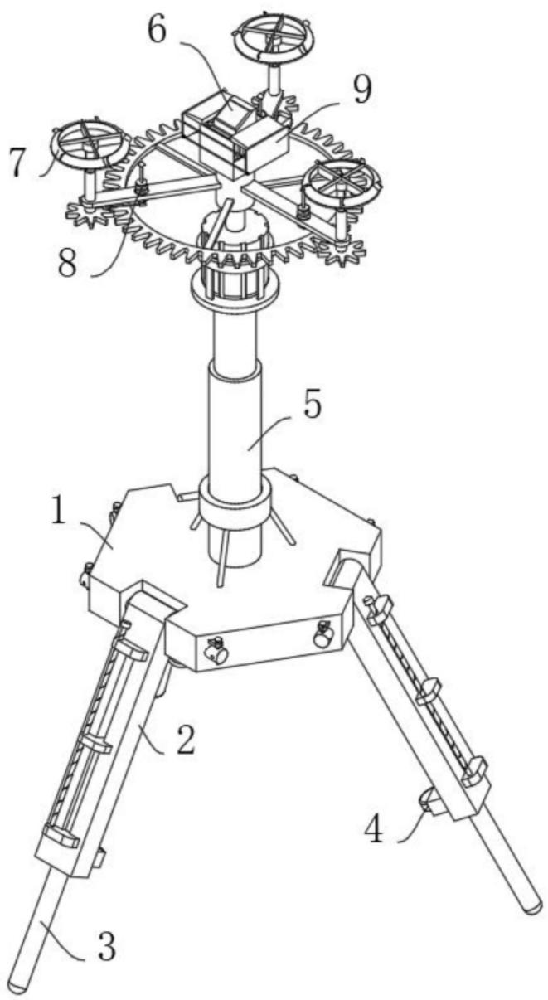  
图1

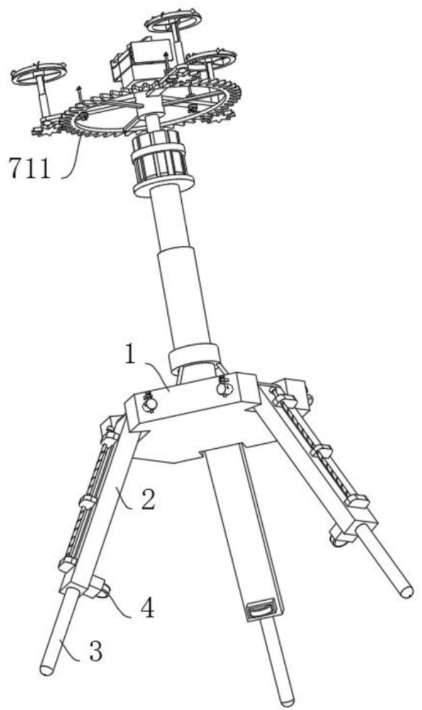  
图2

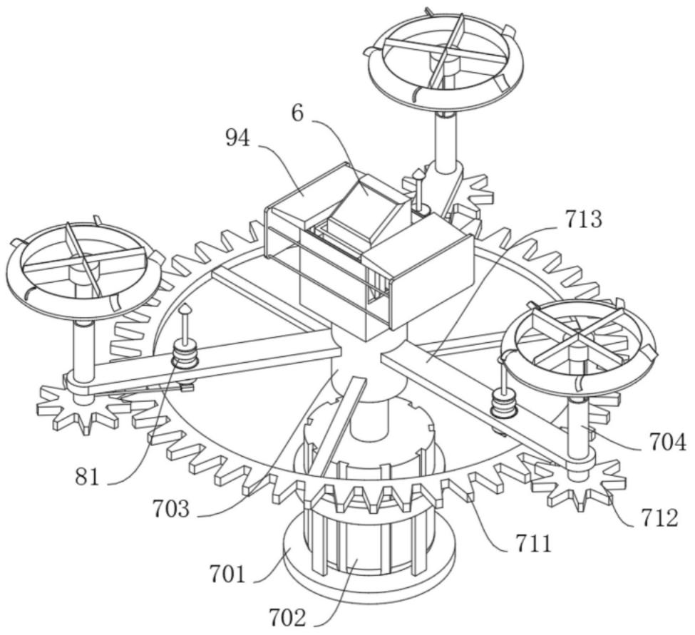  
图3

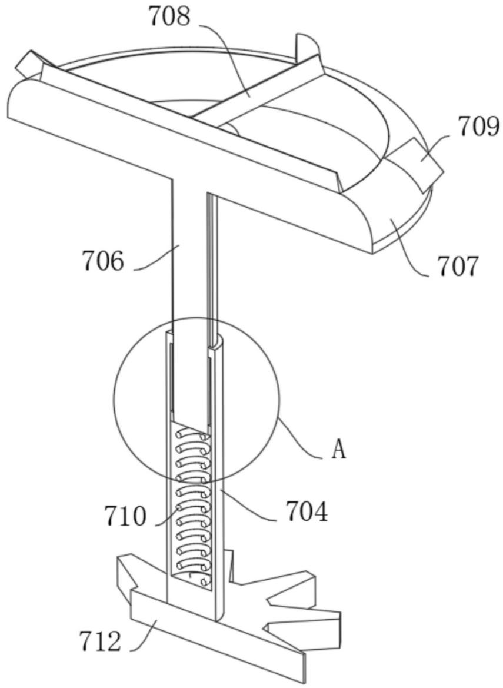  
图4

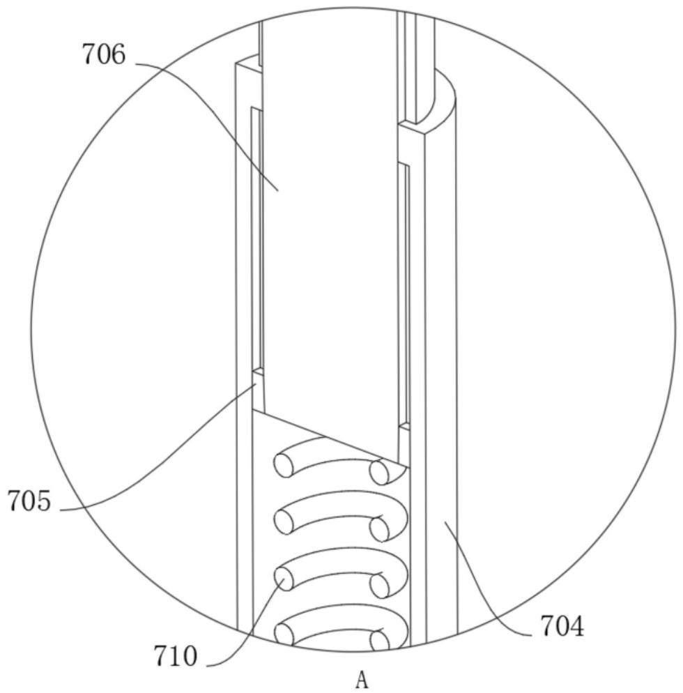  
图5

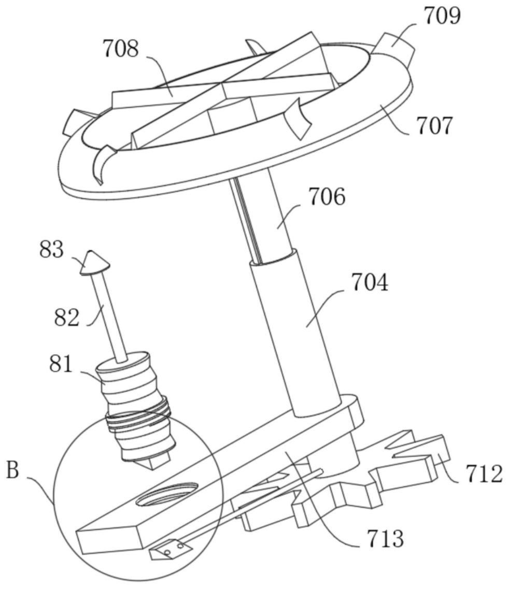  
图6

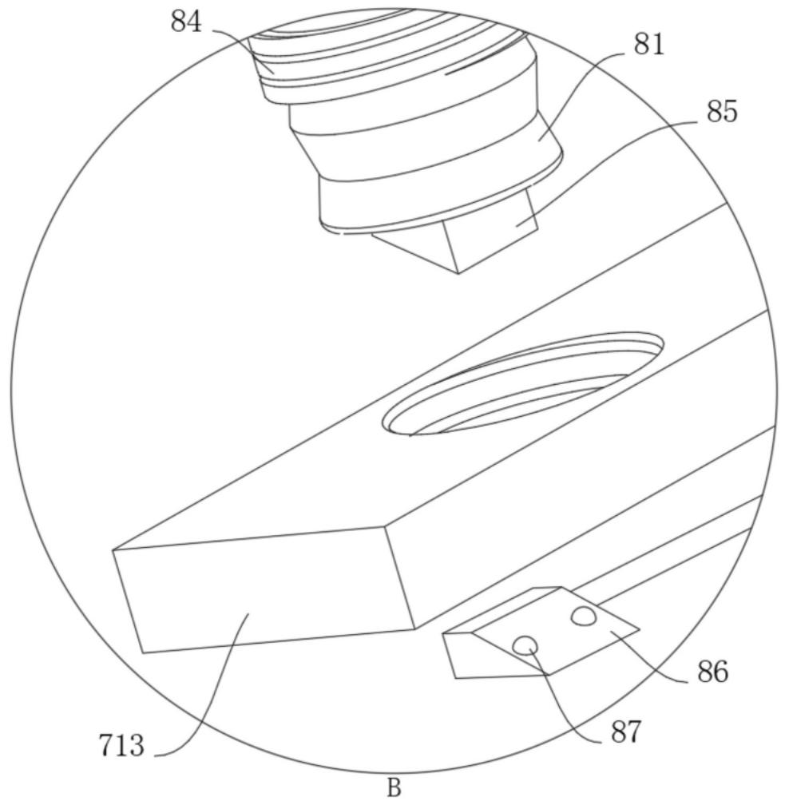  
图7

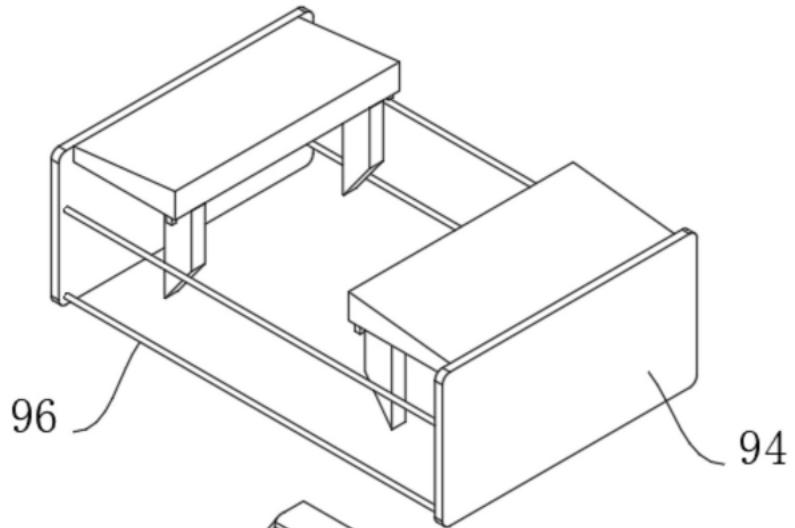

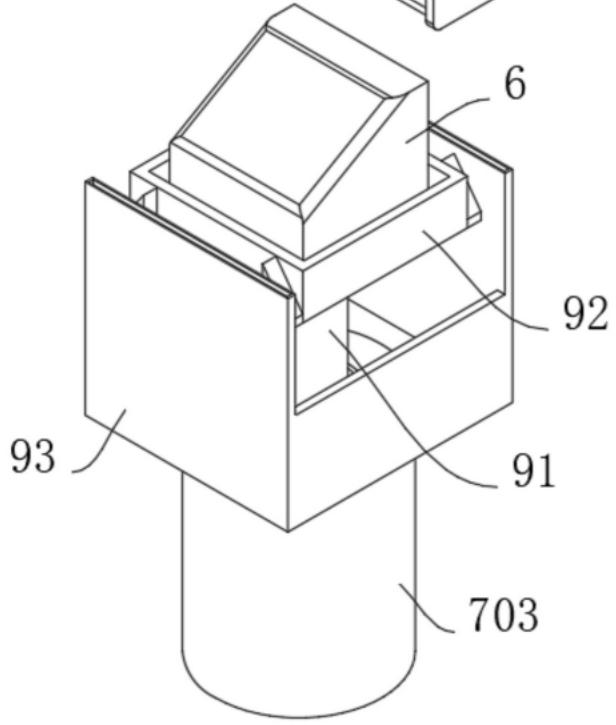  
图8

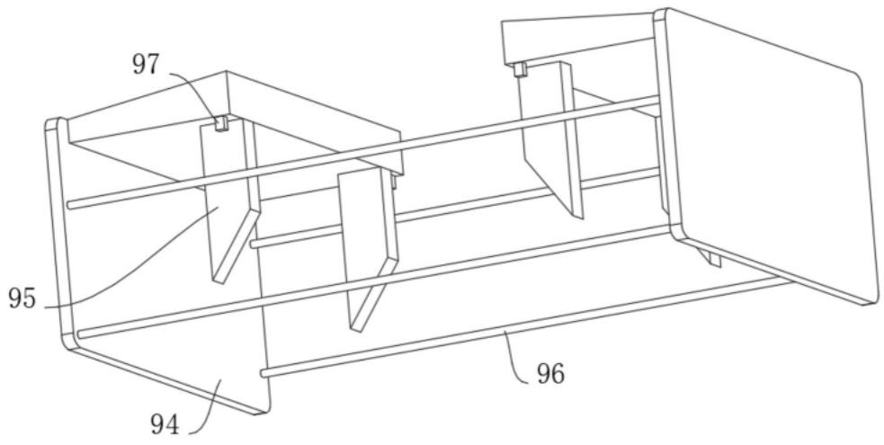  
图9

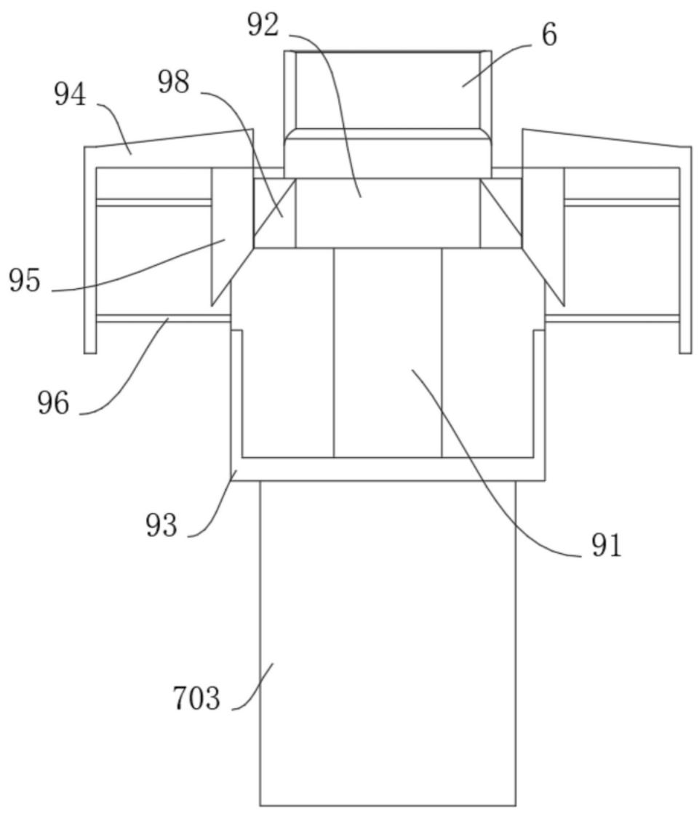  
图10